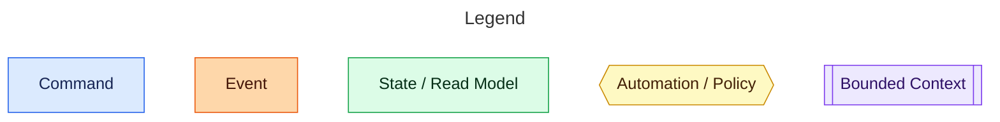

# Gameplay

The Gameplay bounded context owns the game lifecycle. Starting a game begins with setup, but the command still represents the player's intent to start the whole game. Gameplay records that intent, coordinates the setup work owned by other bounded contexts, and publishes when setup is complete and play may begin.

## Event Model

```mermaid
flowchart LR
    actor["Player / Shell"]:::actor
    startCmd["Command<br/>StartGame"]:::command
    setupState["State<br/>GameplayState<br/>Status = InSetup<br/>CompletedInitializations = empty"]:::view
    policy{{"Policy / Automation<br/>start bounded-context setup"}}:::automation
    rondelCmd["Outbound Command<br/>SetRondelToStartingPositions"]:::command
    rondelBc[["Rondel BC"]]:::bc
    positionedEvt["Inbound Event<br/>RondelPositionedAtStart"]:::event
    inPlayState["State<br/>GameplayState<br/>Status = InPlay<br/>CompletedInitializations contains RondelStartingPositions"]:::view
    completedEvt["Event<br/>SetupCompleted"]:::event

    actor --> startCmd
    startCmd --> setupState
    setupState --> policy
    policy --> rondelCmd
    rondelCmd --> rondelBc
    rondelBc --> positionedEvt
    positionedEvt --> inPlayState
    inPlayState --> completedEvt

    classDef actor fill:#f4f4f5,stroke:#71717a,color:#18181b;
    classDef command fill:#dbeafe,stroke:#2563eb,color:#172554;
    classDef event fill:#fed7aa,stroke:#ea580c,color:#431407;
    classDef view fill:#dcfce7,stroke:#16a34a,color:#052e16;
    classDef automation fill:#fef9c3,stroke:#ca8a04,color:#422006;
    classDef bc fill:#ede9fe,stroke:#7c3aed,color:#2e1065;
```

## Flow

1. A player or shell sends `StartGame` to Gameplay.
2. Gameplay validates the requested nations and player roster, creates `GameplayState`, sets `Status = InSetup`, and records `CompletedInitializations = Set.empty`.
3. Gameplay dispatches `SetRondelToStartingPositions` to Rondel as an outbound command.
4. Rondel performs its own setup and publishes `PositionedAtStart`.
5. Gameplay handles that non-native event as `RondelPositionedAtStart`.
6. Gameplay records `RondelStartingPositions` in `CompletedInitializations`.
7. With the currently known setup work complete, Gameplay moves the game to `Status = InPlay` and publishes `SetupCompleted`.

`SetupCompleted` is the only Gameplay integration event in this slice. It means Gameplay has received the required setup confirmation from downstream bounded contexts and the game is playable.

## Design Notes

`StartGame` is the only native command in this slice. The command carries canonical nations and a `PlayerRoster`, leaving player-count and duplicate-player rules inside the roster value object rather than scattering them across handlers.

Gameplay emits native integration events through `GameplayEvent`. It accepts non-native integration events through `GameplayInboundEvent`. Outbound commands are modeled separately through `GameplayOutboundCommand`, keeping facts and requests distinct.

`CompletedInitializations` is stored in `GameplayState` so future setup acknowledgements can be added without changing the status model. There is no stored required-initialization set; the completion policy remains code-owned.
