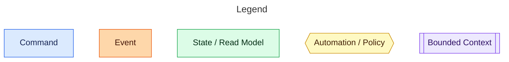

# Gameplay

The Gameplay bounded context owns the game lifecycle. Starting a game begins with setup, but the command still represents the player's intent to start the whole game. Gameplay records that intent, coordinates setup work owned by other bounded contexts, publishes when setup is complete, and exposes a small status projection for callers that need to know whether play has begun.

## Event Model

```mermaid
flowchart LR
    actor["Player / Shell"]:::actor
    startCmd["Command<br/>StartGame<br/>GameId + PlayerRoster"]:::command
    setupState["State<br/>GameplayState<br/>Status = InSetup<br/>Players stored<br/>CompletedInitializations = empty"]:::view
    policy{{"Policy / Automation<br/>start bounded-context setup"}}:::automation
    rondelCmd["Outbound Command<br/>SetRondelToStartingPositions<br/>Nations = NationId.all"]:::command
    rondelBc[["Rondel BC"]]:::bc
    positionedEvt["Inbound Event<br/>RondelPositionedAtStart"]:::event
    inPlayState["State<br/>GameplayState<br/>Status = InPlay<br/>CompletedInitializations contains GameInitialization.Rondel"]:::view
    completedEvt["Event<br/>SetupCompleted"]:::event
    statusQuery["Query<br/>GetGameplayStatus"]:::command
    statusView["Projection<br/>GameplayStatusView<br/>GameId + InPlay + NumberOfPlayers"]:::view

    actor --> startCmd
    startCmd --> setupState
    setupState --> policy
    policy --> rondelCmd
    rondelCmd --> rondelBc
    rondelBc --> positionedEvt
    positionedEvt --> inPlayState
    inPlayState --> completedEvt
    setupState -.-> statusQuery
    inPlayState -.-> statusQuery
    statusQuery -.-> statusView

    classDef actor fill:#f4f4f5,stroke:#71717a,color:#18181b;
    classDef command fill:#dbeafe,stroke:#2563eb,color:#172554;
    classDef event fill:#fed7aa,stroke:#ea580c,color:#431407;
    classDef view fill:#dcfce7,stroke:#16a34a,color:#052e16;
    classDef automation fill:#fef9c3,stroke:#ca8a04,color:#422006;
    classDef bc fill:#ede9fe,stroke:#7c3aed,color:#2e1065;
```

## Flow

1. A player or shell sends `StartGame` to Gameplay.
2. The contract transformation validates `GameId` and converts `PlayerIds` into a `PlayerRoster`.
3. Gameplay creates `GameplayState`, stores the roster, sets `Status = InSetup`, and records `CompletedInitializations = Set.empty`.
4. Gameplay dispatches `SetRondelToStartingPositions` to Rondel as an outbound command using `NationId.all`.
5. Rondel performs its own setup and publishes `PositionedAtStart`.
6. Gameplay handles that inbound event as `RondelPositionedAtStart`.
7. Gameplay records `GameInitialization.Rondel` in `CompletedInitializations`.
8. With the currently known setup work complete, Gameplay moves the game to `Status = InPlay` and publishes `SetupCompleted`.

`SetupCompleted` is the only Gameplay integration event in this slice. It means Gameplay has received the required setup confirmation from downstream bounded contexts and the game is playable.

## Queries

`Gameplay.getGameplayStatus` handles `GetGameplayStatusQuery` and returns `Async<GameplayStatusView option>`. Unknown games return `None`. Known games return a projection with:

- `GameId`
- `InPlay`, derived from `GameplayState.Status`
- `NumberOfPlayers`, derived from the stored `PlayerRoster`

The query path uses `GameplayQueryDependencies.LoadStatus`, so read-side storage can provide the projection directly. Tests currently build it from `GameplayState` through `GameplayStatusProjection.fromState`.

## Design Notes

`StartGame` is the only native command in this slice. The contract command carries `GameId` and `PlayerIds`; the domain command carries `GameId` and `PlayerRoster`. It does not carry nations. Imperial always uses the six canonical Great Powers, so Gameplay dispatches Rondel setup with `NationId.all`.

Starting an already-started game is idempotent and produces no effects. A duplicate `RondelPositionedAtStart` after setup completion is also ignored. A `RondelPositionedAtStart` for an unknown game is ignored.

Gameplay emits native integration events through `GameplayEvent`. It accepts non-native integration events through `GameplayInboundEvent`. Outbound commands are modeled separately through `GameplayOutboundCommand`, keeping facts and requests distinct.

Write-side handlers return `GameplayEffects` and the facade commits those effects through `GameplayDependencies.Commit`. The current public facade is `Gameplay.execute`, `Gameplay.handle`, and `Gameplay.getGameplayStatus`.

`CompletedInitializations` is stored in `GameplayState` so future setup acknowledgements can be added without changing the status model. There is no stored required-initialization set; the completion policy remains code-owned.
